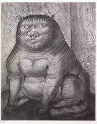

# **Web de los gatos**
## Este es el codigo que use para crear la pagina de los gatos, esta escrita en HTML
<br>
<br>

``````
<!DOCTYPE html>
<html lang="en">
<head>
    <meta charset="UTF-8">
    <meta http-equiv="X-UA-Compatible" content="IE=edge">
    <meta name="viewport" content="width=device-width, initial-scale=1.0">
    <title>WebGatos</title>
    <style>
        .container{
            display: flex;
            flex-direction: row;
            gap: 10px; ;
        }
        .container img{
            width: 100px;
            border-radius: 10px;
            box-shadow: 10px 10px 5px 0px rgba(0,0,0,0.75);;

        }
        h2{
            background: #25CC0F;
            background: linear-gradient(to bottom right, #25CC0F 0%, #9E3212 100%);
            -webkit-background-clip: text;
            -webkit-text-fill-color: transparent;

        }


    </style>

</head>
<body>
    <h2>La mejor web de gatos</h2>
    <div class="container">
        
        
        
        
        
    </div>
</body>
</html>
``````
<br>
<br>

*Esta es una de las imagenes que puse en mi pagina web de gatos:*
<br>
<br>

<br>
<br>

### **Estos son los pasos que seguí para subir este documento escrito en Markdown a GitHub:**
- Subir los cambios a git hub:
  - [x] git innit
  - [X] git add .
  - [X] git commit -m ""
  - [ ] git pull
  - [X] git push origin master
  
  <br>
  <br>
  
  ### ¿Qué por qué escogí estos gatos?

  - Son graciosos
  - No todos los gatos son majos
  - Los perros molan más
  - Tengo tortugas en casa XD
  - Esta frase es para acabar la lista
  
<br>
<br>

### Tabla comparativa de gatos según ciertas caracteríticas:
<br>
<br>

|Nombre | Pelaje |Color | Peso| Altura|
|  ---  |:-----: | ---- |-----| ----- |
|Persa  |    Largo    |  Variedad alta de color del pelaje   |  2.3 a 6.8 kg   |   Medio - Grande   |
|Siamés |     Corto   |  Claro  | 2.5 a 4.8 kg   |  Medio     |
|Azul Ruso  |  Corto |  Oscuro  | 2 a 4.5 kg    |    Medio   |
|Balinés|    Largo   | Claro   |  4.5  a 5.4 kg     | Medio     |


Mención honorífica a nuestro profesor Angel😁🖖, pasar por su perfil (@Kant003) y darle una ⭐.
<br>
_Esta pagina web ha sido construida por java script vanilla y css_
<br>
 Si ~~no~~ quieres probarla entra en esta URL ----> https://iagocp.github.io/WebGatos/
<br>
Si sigues queriendo ver más gatos vete a wikipedia o al medico a lo mejor es obsesión ---->  https://es.wikipedia.org/wiki/Felis_silvestris_catus


> Tarea:

- Algo en negrita, cursiva y tachado 
- Enlace a la wikipedia (gatos)
-  Foto de gato
-  Mencion al profe angel (kant003)
-  Titulo principal dos secundarios
-  Lista no numerada
- Checklist con unas cuantas tareas marcadas y otras desmacardas
- Un trozo de codigo de fuente escrito en algún lenguaje
- Tabla comparativas de razas de gatos
- Algun emoji
- Subir los cambios a git hub:
  -  git innit
  -  git add .
  -  git commit -m ""
  -  git push


